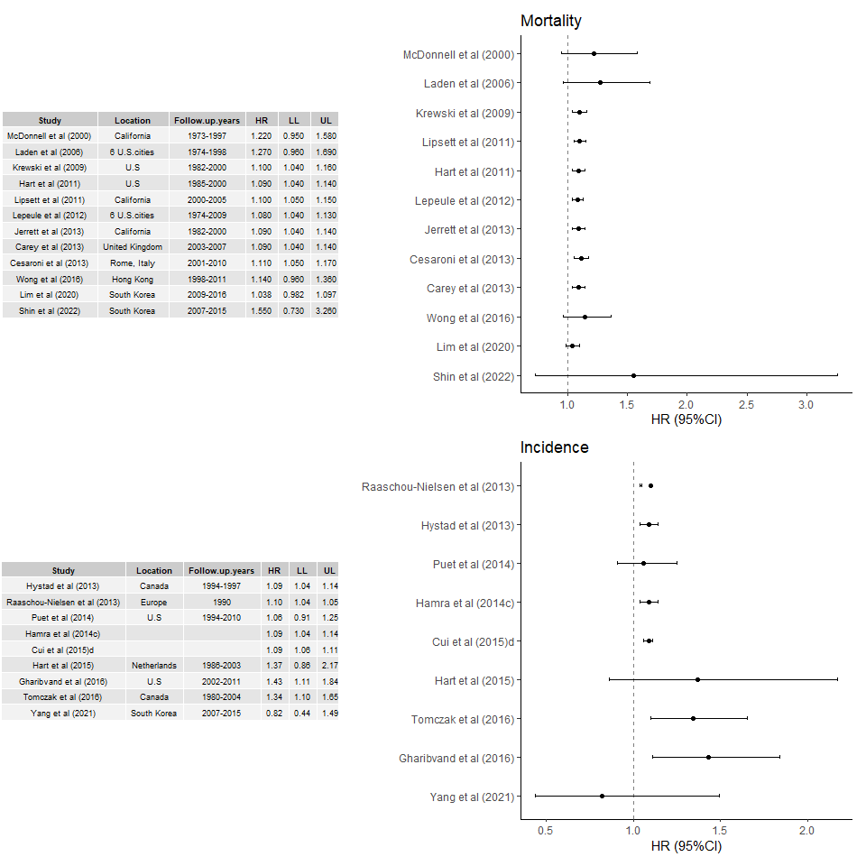

R_forest_plot
================
Cham Nguyen
2022-10-10

``` r
data <- read.csv('C:/Users/Cham Nguyen/Desktop/meta.csv')

library(pacman)

pacman::p_load(dplyr, ggplot2, ggpmisc, patchwork) 


as.data.frame(data)
```

    ##    ID                         Study Year            Cohort       Location
    ## 1  12           Hystad et al (2013) 2013             NECSS         Canada
    ## 2  13 Raaschou-Nielsen et al (2013) 2013            ESCAPE         Europe
    ## 3  14             Puet et al (2014) 2014               NHS            U.S
    ## 4  15           Hamra et al (2014c) 2014                                 
    ## 5  16             Cui et al (2015)d 2014                                 
    ## 6  17             Hart et al (2015) 2015              NCLS    Netherlands
    ## 7  19       Gharibvand et al (2016) 2016          AHSMOG-2            U.S
    ## 8  20          Tomczak et al (2016) 2016             CNBSS         Canada
    ## 9  21             Yang et al (2021) 2021                      South Korea
    ## 10  1        McDonnell et al (2000) 2000           AHSM OG     California
    ## 11  2            Laden et al (2006) 2006               HSC   6 U.S.cities
    ## 12  3          Krewski et al (2009) 2009 ACS (Re-analysis)            U.S
    ## 13  4             Hart et al (2011) 2011             TrIPS            U.S
    ## 14  5          Lipsett et al (2011) 2011               CTS     California
    ## 15  6          Lepeule et al (2012) 2012               HCS   6 U.S.cities
    ## 16  7          Jerrett et al (2013) 2013        ACS-CPS II     California
    ## 17  8            Carey et al (2013) 2013  National English United Kingdom
    ## 18  9         Cesaroni et al (2013) 2013              RoLS    Rome, Italy
    ## 19 18             Wong et al (2016) 2016                        Hong Kong
    ## 20 11              Lim et al (2020) 2020                      South Korea
    ## 21 10             Shin et al (2022) 2022                      South Korea
    ##    Follow.up.years  Qualifier    HR    LL    UL     Group  Notes
    ## 1        1994-1997            1.090 1.040 1.140 Incidence      A
    ## 2             1990            1.100 1.040 1.050 Incidence      B
    ## 3        1994-2010      Women 1.060 0.910 1.250 Incidence       
    ## 4                  14 studies 1.090 1.040 1.140 Incidence       
    ## 5                  12 studies 1.090 1.060 1.110 Incidence       
    ## 6        1986-2003            1.370 0.860 2.170 Incidence       
    ## 7        2002-2011            1.430 1.110 1.840 Incidence       
    ## 8        1980-2004      Women 1.340 1.100 1.650 Incidence       
    ## 9        2007-2015            0.820 0.440 1.490 Incidence 1 year
    ## 10       1973-1997        Men 1.220 0.950 1.580 Mortality       
    ## 11       1974-1998            1.270 0.960 1.690 Mortality       
    ## 12       1982-2000            1.100 1.040 1.160 Mortality       
    ## 13       1985-2000        Men 1.090 1.040 1.140 Mortality       
    ## 14       2000-2005      Women 1.100 1.050 1.150 Mortality       
    ## 15       1974-2009            1.080 1.040 1.130 Mortality       
    ## 16       1982-2000            1.090 1.040 1.140 Mortality       
    ## 17       2003-2007            1.090 1.040 1.140 Mortality       
    ## 18       2001-2010            1.110 1.050 1.170 Mortality       
    ## 19       1998-2011            1.140 0.960 1.360 Mortality       
    ## 20       2009-2016            1.038 0.982 1.097 Mortality       
    ## 21       2007-2015            1.550 0.730 3.260 Mortality

``` r
data1 <- data %>% 
  filter(Group == 'Mortality')
data2 <- data %>% 
  filter(Group == 'Incidence')


data_table1 <- data %>% 
  filter(Group == "Mortality") %>% 
  select(Study, Location, Follow.up.years, HR, LL, UL)


data_table2 <- data %>% 
  filter(Group == "Incidence") %>% 
  select(Study, Location, Follow.up.years, HR, LL, UL)

p1 <- ggplot() +                             # Create empty plot with table
  theme_void() +
  annotate(geom = "table",
           x = 1,
           y = 1,
           label = list(data_table1),
           size = 2.5)+
  geom_text(size = 15)

p2 <- ggplot(data = data1, aes(y= reorder(Study, - Year), x= HR, xmin=LL, xmax=UL)) +
  geom_point() + 
  geom_errorbarh(height=.1) +
  labs(x='HR (95%CI)', y = "") +
  geom_vline(xintercept=1, color='black', linetype='dashed', alpha=.5) +
  ggtitle("Mortality")+
  theme_classic()


p3 <- ggplot() +                             # Create empty plot with table
  theme_void() +
  annotate(geom = "table",
           x = 1,
           y = 1,
           label = list(data_table2),
           size = 2.5)+
    geom_text(size = 15)


p4 <- ggplot(data = data2, aes(y= reorder(Study, - Year), x= HR, xmin=LL, xmax=UL)) +
  geom_point() + 
  geom_errorbarh(height=.1) +
  labs(x='HR (95%CI)', y = "") +
  geom_vline(xintercept=1, color='black', linetype='dashed', alpha=.5) +
  ggtitle("Incidence")+
  theme_classic()

p1+p2+p3+p4
```


